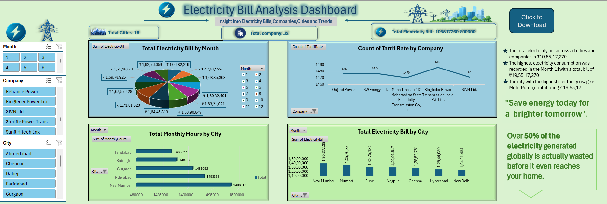

## Electricity Bill Analysis Dashboard

## Overview
An interactive Excel dashboard developed to analyze electricity consumption and billing patterns across multiple cities and companies. The project converts raw billing data into meaningful insights using data visualization, KPI tracking, and interactive filtering.

## Objectives
* Analyze monthly electricity consumption trends
* Compare city-wise and company-wise electricity usage
* Monitor tariff distribution and usage hours
* Build an interactive and user-friendly dashboard
* Generate actionable business insights from raw data

## Dataset
The dataset includes:
* Month
* City
* Company Name
* Electricity Bill
* Tariff Rate
* Monthly Usage Hours

## Dashboard preview

## Key Features
* Interactive slicers for filtering data
* KPI cards for quick summary analysis
* Pivot charts and visualizations
* City-wise and month-wise analysis
* VBA-based report export feature

## Key Insights
* Major cities show higher electricity consumption trends
* Electricity cost is strongly influenced by usage hours
* Tariff rates remain relatively consistent across companies
* Monthly usage patterns remain stable with slight variations

## Tools & Technologies
* Microsoft Excel
* Pivot Tables & Pivot Charts
* Slicers
* Conditional Formatting
* VBA Macro

## How to Use
1. Open the Excel workbook
2. Navigate to the dashboard sheet
3. Use slicers to filter data
4. Analyze KPIs and charts
5. Export the dashboard report using the download button

## Future Improvements

* Add forecasting and trend prediction
* Integrate real-time electricity data
* Enhance dashboard interactivity
* Extend analysis using Power BI
